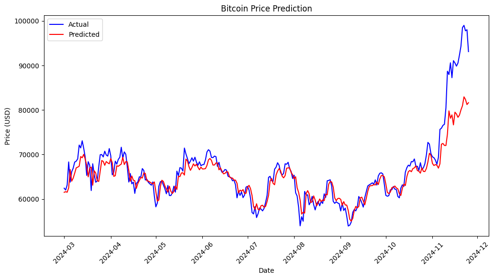

# Bitcoin Price Prediction with LSTM

## Table of Contents

- [Introduction](#introduction)
- [Structure](#structure)
- [Features](#features)
- [Results](#results)

## Introduction

This repository showcases a robust deep learning model designed to forecast Bitcoin prices using historical data. Leveraging the power of Long Short-Term Memory (LSTM) networks, this project aims to provide accurate predictions that can aid traders, investors, and enthusiasts in making informed decisions.

## Structure

## Features

- **Data Acquisition:** Utilizes the `yfinance` library to fetch historical Bitcoin price data from Yahoo Finance.
- **Data Visualization:** Provides clear visualizations of training and testing datasets to understand price trends.
- **Data Preprocessing:** Implements Min-Max scaling and sequence creation to prepare data for the LSTM model.
- **Deep Learning with PyTorch:** Builds and trains a multi-layer LSTM model using PyTorch.
- **Model Evaluation:** Tracks training and validation loss over epochs to monitor model performance.
- **Prediction Visualization:** Compares actual vs. predicted Bitcoin prices with comprehensive plots.
- **Scalability:** Designed to handle large datasets and can be extended to other cryptocurrencies or financial instruments.

## Results

The model was trained for 100 epochs, achieving promising results in both training and validation phases.
There's a plot in the project that compares the actual Bitcoin prices with the model's predictions, demonstrating the model's accuracy and reliability.

